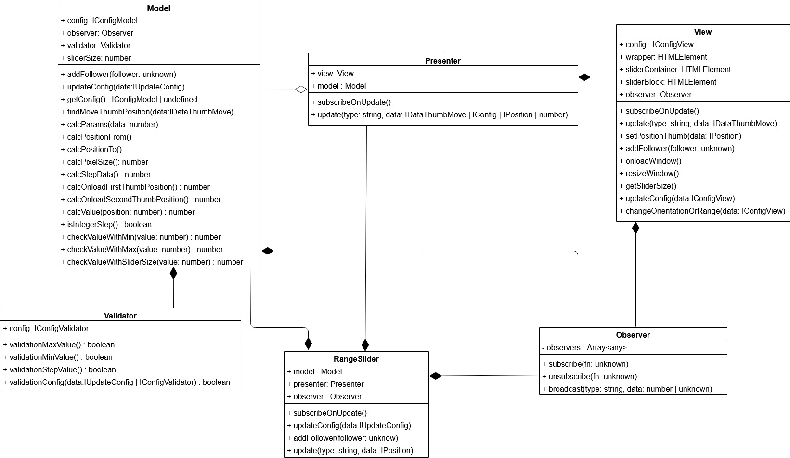
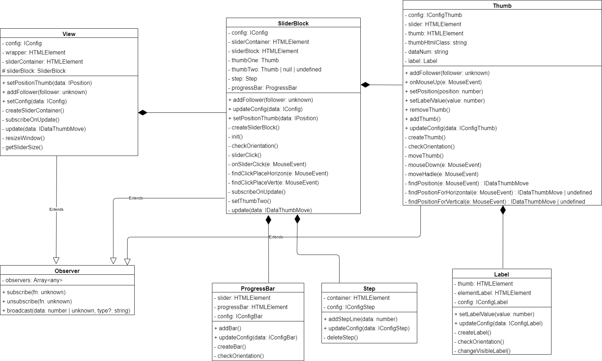

# Range slider jQuery plugin

Тестовое задание для компании Fullstack Development

[Демо-страница](https://vendalma.github.io/fsd_4step/)

## Скачать репозиторий

https://github.com/Vendalma/fsd_4step.git

## NPM

`npm install ` - инициализация проекта

`npm run build-dev` - development build

`npm run build-prod` - production build

`npm run start` - запуск dev-server

`npm run test` - запуск тестов

`npm run lint` - запуск линтера

`npm run deploy` - загрузка проекта на GitHub Pages

## Описание

Архитектура приложения разделена на три слоя:

`Model` - валидирует данные и производит расчеты

`View` - отображает компоненты слайдера

`Presenter` - занимается передачей данных между Model и View

Взаимодействие Model и View c Presenter осуществляется с помощью шаблона Observer

## Подключение плагина

```
$('#id').rangeSlider()
```

При инициализации плагина можно указать необходимые параметры:

```
$('#id').rangeSlider({
  step: 5,
  range: false
})
```

| Опции        |   Тип   | Значение по умолчанию | Описание                          |
| ------------ | :-----: | :-------------------: | --------------------------------- |
| min          | number  |           0           | Минимальное значение              |
| max          | number  |          100          | Максимальное значение             |
| step         | number  |           1           | Размер шага                       |
| positionFrom | number  |          10           | Начальная позиция первого бегунка |
| positionTo   | number  |          50           | Начальная позиция второго бегунка |
| range        | boolean |         true          | Одинарный/двойной слайдер         |
| vertical     | boolean |         false         | Ориентация слайдера               |
| label        | boolean |         true          | Отображение значения бегунка      |

## Методы плагина

Слайдер имеет два метода

```
$('#id').rangeSlider()

//Обновление параметров плагина
$('#id').rangeSlider('updateConfig', {min: -100});

//Получение позиций бегунков
function fn(value) {
  console.log(value)
}

$('#id').rangeSlider('returnPosition', fn);

/*
{
  positionFrom: 0,
  positionTo : 100
}
*/
```

## Диаграмма



---


