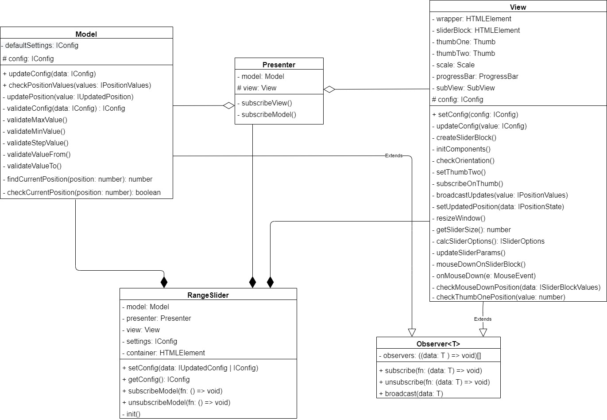
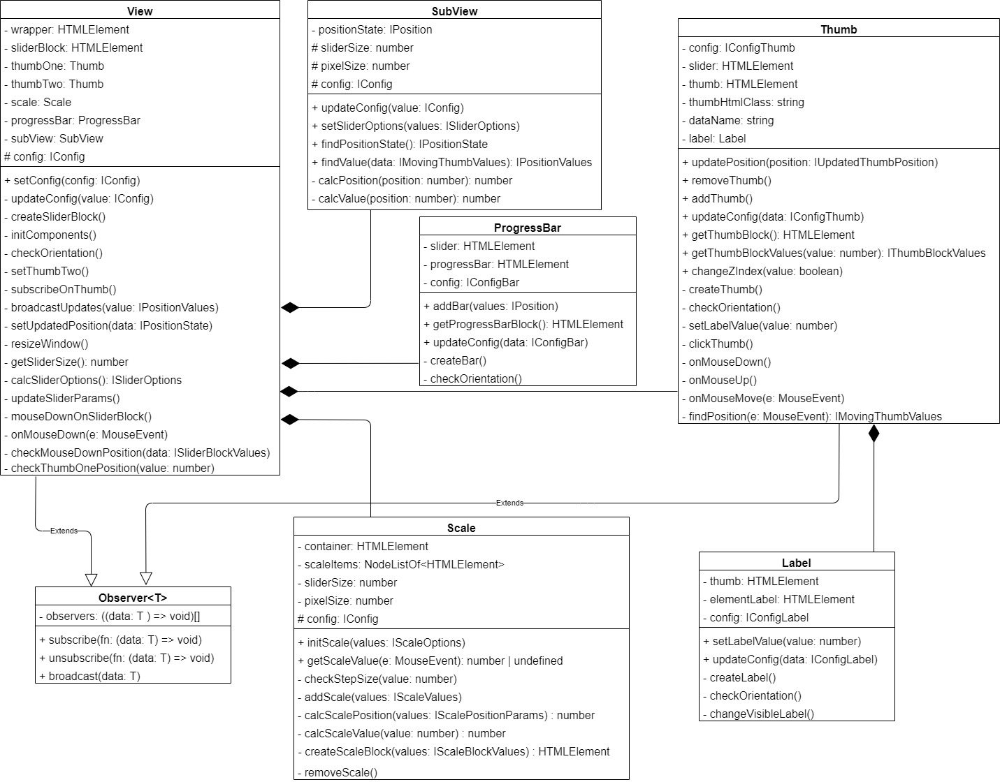

# Range slider jQuery plugin

Тестовое задание для компании MetaLamp

[Демо-страница](https://vendalma.github.io/fsd_4step/)

## Скачать репозиторий

https://github.com/Vendalma/fsd_4step.git

## Инициализация проекта(совместимо с Node.js 14.x)

1. Установить необходимые зависимости - `npm install`

2. Собрать проект в режиме разработки - `npm run dev`

3. Запустить локальный сервер - `npm run start`

4. Сборка релизной версии проекта - `npm run build`

5. Деплой на GitHub Pages - `npm run deploy`

---

Команда для запуска тестов - `npm run test`

---

Проверка кода с помощью ESlint - `npm run lint`

Проверка стилей с помощью stylelint - `npm run stylelint`

## Описание

Архитектура приложения разделена на три слоя:

`Model` - валидирует данные и сообщает об их изменениях

`View` - отображает компоненты слайдера и рассчитывает позиции бегунков

`Presenter` - передает данные между Model и View

Взаимодействие Model и View c Presenter осуществляется с помощью шаблона Observer

## Подключение плагина

```
$('#id').rangeSlider()
```

При инициализации можно указать необходимые параметры:

```
$('#id').rangeSlider({
  step: 5,
  range: false
})
```

| Опции        |   Тип   | Значение по умолчанию | Описание                          |
| ------------ | :-----: | :-------------------: | --------------------------------- |
| min          | number  |           0           | Минимальное значение              |
| max          | number  |          100          | Максимальное значение             |
| step         | number  |           1           | Размер шага                       |
| positionFrom | number  |          10           | Начальная позиция первого бегунка |
| positionTo   | number  |          50           | Начальная позиция второго бегунка |
| range        | boolean |         true          | Одинарный/двойной слайдер         |
| vertical     | boolean |         false         | Ориентация слайдера               |
| label        | boolean |         true          | Отображение значения бегунка      |

## Методы

Обновление параметров плагина

```
$('#id').rangeSlider('setConfig', {min: -100});
```

Получение обновленных параметров слайдера

```
const fn = ((sliderSettings) => {
  console.log(changedSettings);
});

$('#id').rangeSlider('subscribe', fn);

/*
{
  "value": {
    "min": 0,
    "max": 100,
    "label": true,
    "range": true,
    "step": 1,
    "vertical": false,
    "valueFrom": 8,
    "valueTo": 50
  },
  "type": "configChanged"
}
*/
```

Отписка от обновлений слайдера

```
const fn = ((sliderSettings) => {
  console.log(changedSettings);
});

$('#id').rangeSlider('subscribe', fn);

$('#id').rangeSlider('unsubscribe', fn);

/*
  в консоли ничего не появится, т.к. ф-я fn отписана от обновлений слайдера
*/
```

## Диаграмма



---


